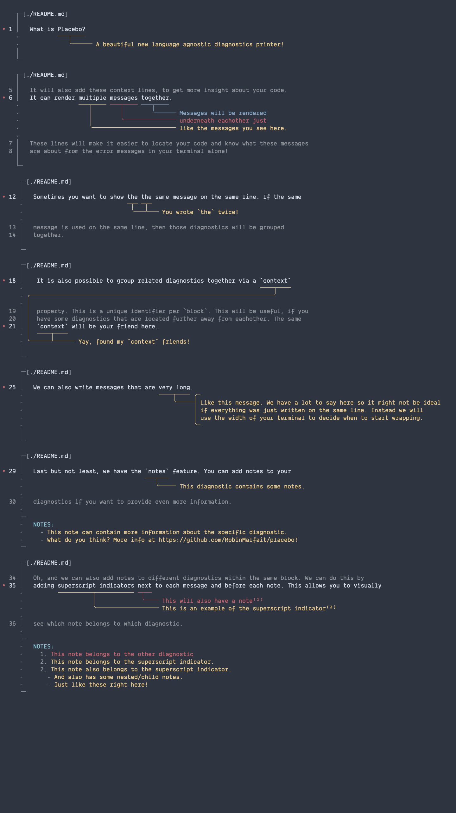

## Placebo

A beautiful new language agnostic diagnostics printer!

<!-- GENERATED -->

```

    ┌─[./README.md]
    │
∙ 1 │   What is Placebo?
    ·           ───┬────
    ·              ╰────── A beautiful new language agnostic diagnostics printer!
    │
    └─
```

```
    ┌─[./README.md]
    │
  5 │   It will also add these context lines, to get more insight about your code.
∙ 6 │   It can render multiple messages together.
    ·                 ───┬──── ───┬──── ───┬────
    ·                    │        │        ╰────── Messages will be rendered
    ·                    │        ╰─────────────── underneath each other just
    ·                    ╰──────────────────────── like the messages you see here.
    ·
  7 │   These lines will make it easier to locate your code and know what these messages
  8 │   are about from the error messages in your terminal alone!
    │
    └─
```

```
     ┌─[./README.md]
     │
∙ 12 │   Sometimes you want to show the the same message on the same line. If the same
     ·                              ─┬─ ─┬─
     ·                               ╰───┴─── You wrote `the` twice!
     ·
  13 │   message is used on the same line, then those diagnostics will be grouped
  14 │   together.
     │
     └─
```

```
     ┌─[./README.md]
     │
∙ 18 │    It is also possible to group related diagnostics together via a `context`
     ·                                                                    ────┬────
     · ╭──────────────────────────────────────────────────────────────────────╯
     · │
  19 │ │  property. This is a unique identifier per `block`. This will be useful, if you
  20 │ │  have some diagnostics that are located further away from each other. The same
∙ 21 │ │  `context` will be your friend here.
     · │  ────┬────
     · ╰──────┴────── Yay, found my `context` friends!
     │
     └─
```

```
     ┌─[./README.md]
     │
∙ 25 │   We can also write messages that are very long.
     ·                                       ────┬──── ╭─
     ·                                           ╰─────┤ Like this message. We have a lot to say here so it might not be ideal
     ·                                                 │ if everything was just written on the same line. Instead we will
     ·                                                 │ use the width of your terminal to decide when to start wrapping.
     ·                                                 ╰─
     │
     └─
```

```
     ┌─[./README.md]
     │
∙ 29 │   Last but not least, we have the `notes` feature. You can add notes to your
     ·                                   ───┬───
     ·                                      ╰───── This diagnostic contains some notes.
     ·
  30 │   diagnostics if you want to provide even more information.
     ·
     ├─
     ·   - This note can contain more information about the specific diagnostic.
     ·   - What do you think? More info at https://github.com/RobinMalfait/placebo!
     └─
```

```
     ┌─[./README.md]
     │
  34 │   Oh, and we can also add notes to different diagnostics within the same block. We can do this by
∙ 35 │   adding superscript indicators next to each message and before each note. This allows you to visually
     ·          ──────────┬─────────── ─┬──
     ·                    │             ╰──── This will also have a note
     ·                    ╰────────────────── This is an example of the superscript indicator
     ·
  36 │   see which note belongs to which diagnostic.
     ·
     ├─
     ·   This note belongs to the other diagnostic
     ├─
     ·
     ·   - This note belongs to the superscript indicator.
     ·   - This note also belongs to the superscript indicator.
     ·     - And also has some nested/child notes.
     ·     - Just like these right here!
     ·
     └─
```

```
     ┌─[./README.md]
     │
∙ 40 │   There is also a very neat feature for when the actual code itself is super long and doesn't fit on one line. In that case
     ·                                                                                                                ─────┬────── ╭─
     ·                                                                                                                     ╰───────┤ We split
     ·                                                                                                                             │ into
     ·                                                                                                                             │ multiple
     ·                                                                                                                             │ lines
     ·                                                                                                                             ╰─
     ·
     │   ↳ we also want to "wrap" the code onto multiple lines and split the diagnostics. This is done because a diagnostic could be
     ·     ──────────┬───────────
     ·               ╰───────────── We split into multiple lines
     ·
     │   ↳ for a single location, but if we split that location in multiple pieces it won't make sense to only highlight one piece of
     │   ↳ the puzzle.                                             ───────┬─────── ╭─
     ·                                                                    ╰────────┤ This one is moved down because it
     ·                                                                             │ exists way past the available space.
     ·                                                                             ╰─
     ·
  41 │   If the line is too long but doesn't contain diagnostics then we can see those as contextual lines for more info. These line will not b…
     │
     └─

```

<details>

<summary>The actual diagnostics input for this readme can be found here.</summary>

```json
[
  {
    "file": "README.md",
    "message": "A beautiful new language agnostic diagnostics printer!",
    "location": [
      [1, 9],
      [1, 17]
    ]
  },
  {
    "file": "README.md",
    "message": "Messages will be rendered",
    "location": [
      [6, 33],
      [6, 41]
    ],
    "block": "96e75980-16bd-4cf6-9964-400a04dd8bfd"
  },
  {
    "file": "README.md",
    "message": "underneath each other just",
    "location": [
      [6, 24],
      [6, 32]
    ],
    "block": "96e75980-16bd-4cf6-9964-400a04dd8bfd"
  },
  {
    "file": "README.md",
    "message": "like the messages you see here.",
    "location": [
      [6, 15],
      [6, 23]
    ],
    "block": "96e75980-16bd-4cf6-9964-400a04dd8bfd"
  },
  {
    "file": "README.md",
    "message": "You wrote `the` twice!",
    "location": [
      [12, 28],
      [12, 31]
    ],
    "block": "9b3e076f-4d6b-48e4-ac09-d000543b8e4b"
  },
  {
    "file": "README.md",
    "message": "You wrote `the` twice!",
    "location": [
      [12, 32],
      [12, 35]
    ],
    "block": "9b3e076f-4d6b-48e4-ac09-d000543b8e4b"
  },
  {
    "file": "README.md",
    "message": "Yay, found my `context` friends!",
    "location": [
      [18, 65],
      [18, 74]
    ],
    "block": "3ddce4cb-4675-419c-9031-0460efad04f9",
    "context": "b44c8924-7ce8-41cc-a47a-e528b4a83301"
  },
  {
    "file": "README.md",
    "message": "Yay, found my `context` friends!",
    "location": [
      [21, 1],
      [21, 10]
    ],
    "block": "3ddce4cb-4675-419c-9031-0460efad04f9",
    "context": "b44c8924-7ce8-41cc-a47a-e528b4a83301"
  },
  {
    "file": "README.md",
    "message": "Like this message. We have a lot to say here so it might not be ideal if everything was just written on the same line. Instead we will use the width of your terminal to decide when to start wrapping.",
    "location": [
      [25, 37],
      [25, 46]
    ]
  },
  {
    "file": "README.md",
    "message": "This diagnostic contains some notes.",
    "location": [
      [29, 33],
      [29, 40]
    ],
    "notes": "- This note can contain more information about the specific diagnostic.\n- What do you think? More info at https://github.com/RobinMalfait/placebo!"
  },
  {
    "file": "README.md",
    "message": "This is an example of the superscript indicator",
    "location": [
      [35, 8],
      [35, 30]
    ],
    "block": "2245f531-04fa-4abf-8dce-ec1012e3dab1",
    "notes": "- This note belongs to the superscript indicator.\n- This note also belongs to the superscript indicator.\n  - And also has some nested/child notes.\n  - Just like these right here!"
  },
  {
    "file": "README.md",
    "message": "This will also have a note",
    "location": [
      [35, 31],
      [35, 35]
    ],
    "block": "2245f531-04fa-4abf-8dce-ec1012e3dab1",
    "notes": "This note belongs to the other diagnostic"
  },
  {
    "file": "README.md",
    "message": "We split into multiple lines",
    "location": [
      [40, 110],
      [40, 145]
    ]
  },
  {
    "file": "README.md",
    "message": "This one is moved down because it exists way past the available space.",
    "location": [
      [40, 301],
      [40, 316]
    ]
  }
]
```

</details>

<!-- /GENERATED -->



---

**Note**, this is still in active development. Currently there is no real API
to use it yet, the diagnostics format can still change, and we may or may not
want to introduce configuration options.

### Examples

1. `git clone https://github.com/RobinMalfait/placebo && cd placebo`
2. `npm install`
3. `npm run build`
4. See below...

| Project                                        | Script                       |
| ---------------------------------------------- | ---------------------------- |
| [CSS](./examples/css/README.txt)               | `node ./examples/css`        |
| [ESLint](./examples/eslint/README.txt)         | `node ./examples/eslint`     |
| [JavaScript](./examples/javascript/README.txt) | `node ./examples/javascript` |
| [README](./examples/readme/README.txt)         | `node ./examples/readme`     |
| [Tailwind CSS](./examples/tailwind/README.txt) | `node ./examples/tailwind`   |
